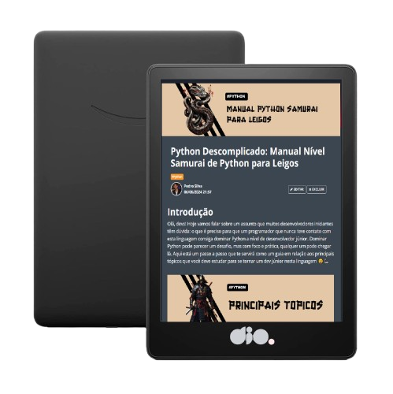

    

  
  

-------

  

# Projeto artigo técnico gerado por I.A.s

 > ℹ️ **NOTE:** Este é o repositório desenvolvido durante o curso Fundamentos de IA para Devs do Santander na plataforma da [DIO](https://dio.me).

Projeto com o objetivo de gerar um artigo técnico com um layout rico, leitura agradável e com foco em promover sua autoridade técnica.

<a href="https://web.dio.me/articles/python-descomplicado-manual-nivel-samurai-de-python-para-leigos?back=%2Farticles&open-modal=true&page=1&order=oldest" title="View PDF now"> 📕Clique aqui para ler o artigo</a>

## 💻 Tecnologias utilizadas no projeto

- [ChatGPT](https://chat.openai.com/) - para título e conteúdo
- [Lexica.art](https://lexica.art/) - para gerar imagens
- [PowerPoint](https://www.microsoft.com/en/microsoft-365/powerpoint) - Para formatação de banners e Layouts

## 📄 Prompts e ferramentas

ChatGPT：

|   Ação   | prompt                                                                                                                                                                                                                                                                         |
| :------: | ------------------------------------------------------------------------------------------------------------------------------------------------------------------------------------------------------------------------------------------------------------------------------ |
|  título  | Crie 10 headlines para nomes de artigos sobre o assunto Manual Python                                                                                                                                                                                                    |
| conteúdo | Comporte-se como um escritor de artigos tech e escreva o artigo atendendo às regras abaixo {REGRAS} No máximo 5 linhas por blocos de explicaçãoMe explique de maneira informal, como se eu fosse uma pessoa de 15 anos Os blocos que serão criados estão abaixo: O que é preciso para um programador que nunca teve contato com esta linguagem consiga dominar Python a nível de desenvolvedor júnior, Listar em bulletpoints o passo a passo com principais assuntos para dominar a linguagem a nível de desenvolvedor júnior, Quais são as boas práticas em projetos Python usadas por desenvolvedores das principais empresas tech, Cite exemplos com códigos abordando boas práticas em Python, Quais são as principais bibliotecas em Python necessárias para dominar o uso da linguagem, Faça uma lista em bulletpoint das principais bibliotecas Python e explique cada uma delas Dê exemplos de trechos de código reais abordando cada uma delas |

Lexica.art：

- No léxica utilizamos o acervo público de imagens geradas por outras pessoas, os termos de pesquisa que utilizei durante a gravação do conteúdo foram:

• Japanese Snake

• Japanese Samurai

• Japanese Scroll

## ✨ Features

- Conteúdo gerado via ChatGPT
- Imagens do acervo público geradas via Lexica.art

## 📚 Materiais

- prompts utilizados

## 🛠️ Instruções de execução

Utilize os prompts acima nas ferramentas sugeridas para gerar o material base e utilize uma ferramenta de edição de documentos como power point, libreoffice , indesign para diagramação, o passo a passo em vídeo pode ser conferido na plataforma da [DIO](https://dio.me).
